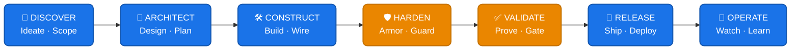

<div align="center">

# 🛠 AI Workflow Playbooks

### Production-grade operational playbooks for AI coding agents across the full software delivery pipeline

[](#the-pipeline)
[](#agent-skills)
[](#guardians)
[](#runbooks)
[](LICENSE)
[](https://claude.ai/code)

**Maintained by [Varun Kulkarni](https://github.com/varunk130)** · [Quick Start ↓](#-quick-start) · [Pipeline Stages ↓](#the-pipeline) · [Contributing](CONTRIBUTING.md)

</div>

---

AI agents are powerful — but without structured guardrails, they cut corners: skipping specifications, ignoring edge cases, bypassing security reviews, and shipping untested code. These playbooks encode the operational discipline of seasoned engineering teams into repeatable, verifiable workflows that any AI agent can follow consistently.

## ⚡ TL;DR — Get Started in 60 Seconds

```bash
git clone https://github.com/varunk130/ai-workflow-playbooks.git
claude --plugin-dir /path/to/ai-workflow-playbooks
# Then in Claude Code, run any pipeline command:
#   /discover  /architect  /construct  /harden  /validate  /release  /operate
```

> Full setup, Cursor/Copilot/Gemini integration, and per-stage details: see [⚡ Quick Start](#-quick-start) below.

## The Problem

When AI agents work without guardrails:

- Requirements get assumed, not documented
- Tests are an afterthought — or absent entirely
- Security surfaces go unexamined
- Code ships without review, monitoring, or rollback plans
- Technical debt compounds silently

## The Solution

This repository provides **21 production playbooks**, **10 agent skills**, **4 specialist guardians**, and **5 operational runbooks** organized across a **7-stage delivery pipeline**. Each playbook is a structured, executable workflow — not a reference document. Agents follow steps, produce artifacts, and meet exit criteria before proceeding.

## The Pipeline



> 🛡 Stages **HARDEN** and **VALIDATE** are gating reviews — a guardian must sign off before the agent proceeds.

### Stage 1: DISCOVER
Define and refine what you're building.

| Playbook | Purpose |
|----------|---------|
| [Discovery & Ideation](playbooks/discovery-and-ideation/PLAYBOOK.md) | Structured exploration of problem space and solution candidates |
| [Specification Authoring](playbooks/specification-authoring/PLAYBOOK.md) | Write a complete spec before any code is written |

### Stage 2: ARCHITECT
Design the system and decompose work.

| Playbook | Purpose |
|----------|---------|
| [Architecture & Decomposition](playbooks/architecture-and-decomposition/PLAYBOOK.md) | Break specs into ordered, verifiable work units |

### Stage 3: CONSTRUCT
Build the system incrementally with quality baked in.

| Playbook | Purpose |
|----------|---------|
| [Iterative Construction](playbooks/iterative-construction/PLAYBOOK.md) | Deliver thin vertical slices with continuous integration |
| [Test-First Engineering](playbooks/test-first-engineering/PLAYBOOK.md) | Red-green-refactor with a disciplined test strategy |
| [Context Orchestration](playbooks/context-orchestration/PLAYBOOK.md) | Feed agents the right context at the right moment |
| [Interface Craftsmanship](playbooks/interface-craftsmanship/PLAYBOOK.md) | Build accessible, maintainable frontend systems |
| [Contract-First APIs](playbooks/contract-first-apis/PLAYBOOK.md) | Design APIs from the contract outward |

### Stage 4: HARDEN
Armor the system against threats and inefficiency.

| Playbook | Purpose |
|----------|---------|
| [Threat Mitigation](playbooks/threat-mitigation/PLAYBOOK.md) | Systematic security hardening across all boundaries |
| [Throughput Tuning](playbooks/throughput-tuning/PLAYBOOK.md) | Measure-first performance optimization |

### Stage 5: VALIDATE
Prove the system works and meets standards.

| Playbook | Purpose |
|----------|---------|
| [Runtime Diagnostics](playbooks/runtime-diagnostics/PLAYBOOK.md) | Browser and runtime verification using live instrumentation |
| [Fault Isolation & Recovery](playbooks/fault-isolation-and-recovery/PLAYBOOK.md) | Systematic debugging from reproduction to resolution |
| [Peer Review Protocol](playbooks/peer-review-protocol/PLAYBOOK.md) | Multi-axis code review with clear severity and verdicts |
| [Complexity Reduction](playbooks/complexity-reduction/PLAYBOOK.md) | Simplify code while preserving behavior |

### Stage 6: RELEASE
Ship with confidence and traceability.

| Playbook | Purpose |
|----------|---------|
| [Version Control Discipline](playbooks/version-control-discipline/PLAYBOOK.md) | Atomic commits, trunk-based flow, clean history |
| [Pipeline Automation](playbooks/pipeline-automation/PLAYBOOK.md) | CI/CD with quality gates and fast feedback |
| [Sunset & Evolution](playbooks/sunset-and-evolution/PLAYBOOK.md) | Managed deprecation and migration paths |
| [Knowledge Capture](playbooks/knowledge-capture/PLAYBOOK.md) | ADRs, API docs, and living documentation |
| [Release Orchestration](playbooks/release-orchestration/PLAYBOOK.md) | Staged rollouts, feature flags, and go-live checklists |

### Stage 7: OPERATE
Monitor, learn, and improve after deployment.

| Playbook | Purpose |
|----------|---------|
| [Observability & Ops](playbooks/observability-and-ops/PLAYBOOK.md) | Post-deploy monitoring, alerting, and incident response |

### Cross-Cutting: Meta

| Playbook | Purpose |
|----------|---------|
| [Meta — How To Use](playbooks/meta-how-to-use/PLAYBOOK.md) | The onboarding playbook: pick the right playbook for the task and stage you're in |

> ℹ️ **New here? Start with the [Meta — How To Use](playbooks/meta-how-to-use/PLAYBOOK.md) playbook** — it's the entry point that routes you to the right stage.

## Agent Skills

Skills are **persistent competency profiles** that define how AI agents behave across all pipeline stages. Unlike playbooks (which are step-by-step workflows), skills are capabilities agents carry throughout a session.

| Skill | Capability |
|-------|-----------|
| [Codebase Navigation](skills/codebase-navigation/SKILL.md) | Efficiently explore, map, and understand unfamiliar codebases |
| [Requirement Extraction](skills/requirement-extraction/SKILL.md) | Transform vague inputs into structured, testable requirements |
| [Safe Refactoring](skills/safe-refactoring/SKILL.md) | Restructure code without changing behavior, verified by tests |
| [Dependency Assessment](skills/dependency-assessment/SKILL.md) | Evaluate packages on maintenance, security, size, and licensing |
| [Error Interpretation](skills/error-interpretation/SKILL.md) | Read error messages and stack traces systematically |
| [Context Window Management](skills/context-window-management/SKILL.md) | Load the right information and omit the noise |
| [Multi-Agent Collaboration](skills/multi-agent-collaboration/SKILL.md) | Coordinate when multiple agents work on the same codebase |
| [Human Escalation](skills/human-escalation/SKILL.md) | Know when to stop and involve a human decision-maker |
| [Incremental Verification](skills/incremental-verification/SKILL.md) | Verify work at every step, not just at the end |
| [Production Awareness](skills/production-awareness/SKILL.md) | Think about production consequences while writing code |

## ⚡ Quick Start

### With Claude Code (Recommended)

```bash
# Clone and reference as a plugin directory
git clone https://github.com/varunk130/ai-workflow-playbooks.git
claude --plugin-dir /path/to/ai-workflow-playbooks
```

Then use pipeline commands:
```text
/discover   → Explore and scope the problem
/architect  → Plan the system and decompose tasks
/construct  → Build incrementally with tests
/harden     → Run security and performance checks
/validate   → Review code quality
/release    → Ship with confidence
/operate    → Set up monitoring and observability
```

### With Other AI Agents

Playbooks are plain Markdown. Copy the relevant `PLAYBOOK.md` files into your agent's system prompt, rules directory, or context window.

| Agent | Integration |
|-------|-------------|
| Cursor | Copy into `.cursor/rules/` |
| GitHub Copilot | Add to `.github/copilot-instructions.md` |
| Gemini CLI | Load as context files |
| Windsurf | Add to Windsurf rules |

See the [docs/](docs/) folder for platform-specific guides.

## Guardians

Specialist review personas that bring focused expertise:

| Guardian | Role | Use When |
|----------|------|----------|
| [Architecture Guardian](guardians/architecture-guardian.md) | Principal Engineer | Reviewing system design, API contracts, data flow |
| [Quality Guardian](guardians/quality-guardian.md) | QA Lead | Assessing test coverage, test strategy, edge cases |
| [Security Guardian](guardians/security-guardian.md) | AppSec Engineer | Auditing auth, input handling, secrets, dependencies |
| [Operations Guardian](guardians/operations-guardian.md) | SRE Lead | Evaluating deployability, observability, runbooks |

## Runbooks

Operational checklists loaded on demand:

| Runbook | Covers |
|---------|--------|
| [Testing Patterns](runbooks/testing-patterns.md) | Test structure, mocking, component and E2E patterns |
| [Security Baseline](runbooks/security-baseline.md) | OWASP Top 10, auth, input validation, headers |
| [Performance Baseline](runbooks/performance-baseline.md) | Core Web Vitals, frontend/backend optimization |
| [Accessibility Baseline](runbooks/accessibility-baseline.md) | WCAG 2.1 AA, keyboard nav, screen readers |
| [Incident Response](runbooks/incident-response.md) | Triage, communication, resolution, postmortem |

## Recommended Starting Set

If you're new, start with these:

0. **[Meta — How To Use](playbooks/meta-how-to-use/PLAYBOOK.md)** — Routes you to the right playbook for what you're doing
1. **Specification Authoring** — Forces clear requirements before code
2. **Test-First Engineering** — Ensures correctness through tests
3. **Peer Review Protocol** — Catches issues before merge

## Design Principles

1. **Workflows, not wikis** — Each playbook is a step-by-step process, not a knowledge article
2. **Guardrails over guidelines** — Exit criteria must be met with evidence, not promises
3. **Anti-pattern inoculation** — Every playbook documents common shortcuts and why they fail
4. **Progressive loading** — Core playbook stays focused; runbooks load only when needed
5. **Agent-agnostic** — Plain Markdown works with any AI agent or IDE
6. **Production-first** — The pipeline extends through deployment into operations

## Contributing

See [CONTRIBUTING.md](CONTRIBUTING.md) for guidelines on writing new playbooks or improving existing ones.

## License

MIT — see [LICENSE](LICENSE) for details.

---

<sub>Built by [Varun Kulkarni](https://github.com/varunk130) — part of a portfolio of AI agent systems for product teams.</sub>
